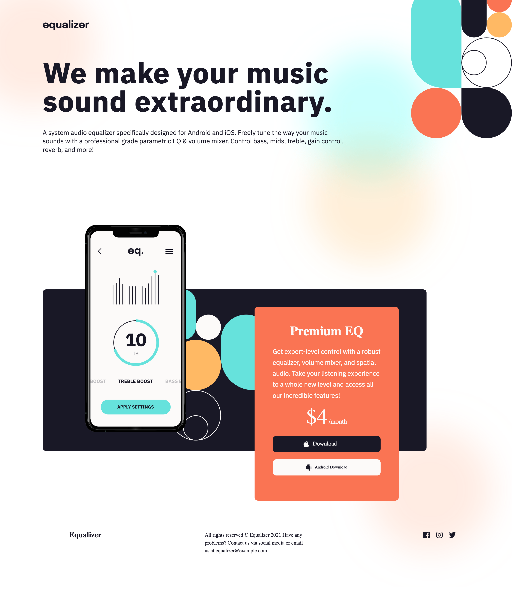

# Frontend Mentor - Equalizer landing page solution

This is a solution to the [Equalizer landing page challenge on Frontend Mentor](https://www.frontendmentor.io/challenges/equalizer-landing-page-7VJ4gp3DE). Frontend Mentor challenges help you improve your coding skills by building realistic projects.

## Table of contents

- [Overview](#overview)
  - [The challenge](#the-challenge)
  - [Screenshot](#screenshot)
  - [Links](#links)
  - [Built with](#built-with)
  - [Continued development](#continued-development)

**Note: Delete this note and update the table of contents based on what sections you keep.**

## Overview

### The challenge

Users should be able to:

- View the optimal layout depending on their device's screen size
- See hover states for interactive elements

### Screenshot

### Links

- Solution URL: (https://github.com/rrebolledo90/Equalizer-Landing-Page)
- Live Site URL: (https://rrebolledo90.github.io/Equalizer-Landing-Page/)

### Built with

- Semantic HTML5 markup
- CSS custom properties
- Flexbox
- CSS Grid

### Continued development

I had a difficult time working with the layout. Some of the layouts were achieved with absolute position. As a result, they did not respond the way I wanted them when I minimized the page. I went ahead and decided to leave this project as is. The optimal view here is at 1000px, anything smaller then that the page starts to break. I plan to revisit this project in the future when I get a better understanding of grid box, as I know you can overlay items. I was able to do this with the mid-container background, second pattern, and also the phone image. However, once I started adding other images, grid started acting odd, therefore I opted to absolute position the orange container, which lead to problems with responsiveness. Overall, I am happy with the desktop view.
